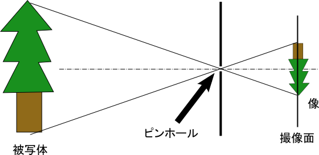
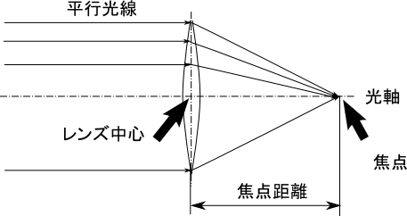
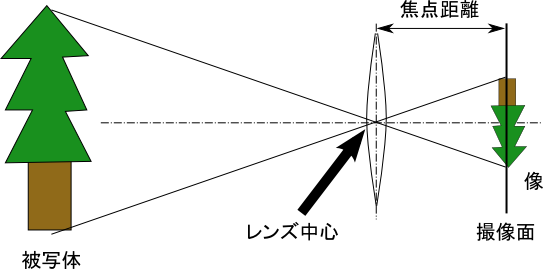
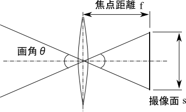

######################
カメラはなぜ写るのか？
######################

************
カメラの原理
************

**弟**

まずはじめに．カメラはなぜ写るのでしょうか？

**姉**

はい！シャッターを押すと写真が撮れます！

**弟**

それは原理じゃなくて機能だよ！
最近本当に姉さんが理系かどうか怪しくなってくるんだけど大丈夫？
そうじゃなくて，シャッターボタンを押したら
何がどうなって写真が撮れるのかっていう話．

**姉**

はい！わかりません．

**弟**

よろしい．じゃまずはそこからね．

******************************
基本中の基本はピンホールカメラ
******************************

そもそもカメラの語源は，
*camera obscura*
つまり暗室のことでした．
真っ暗な部屋のある一点に小さな穴を開けると，
そこから入ってきた光が対面の壁面に投影され，
外の様子が表示されるというもので，
スケッチのために使われていたそうです．

基本的な原理はここから何も変化していません．
針の穴つまり
*ピンホール*
を通る光が投影される，このようなカメラを
*ピンホールカメラ*
と呼びます．きっとどこかで聞いたことがありますよね？よね？

では，このピンホールカメラの原理を図で表してみましょう．

ピンホールカメラの原理

小さな穴を通った光は，上下左右が反転して穴の逆側の壁に当たります．
像の大きさと被写体の大きさは，ピンホールを中心として
撮像面までの距離と被写体までの距離に比例します．
これこそが基本中の基本なのです．

**********
レンズの話
**********

え？さっきの話はおかしい？レンズはどこに行ったって？
そう，今時のカメラはレンズを使っていますね．
ではレンズとは何をするものでしょうか．
はいそうです．
*光を屈折させるのがレンズの役目*
です．
では，レンズを使った場合どのように光は動くのでしょうか？
図に表してみましょう．

レンズの原理

この図でもきっとどこかで聞いたことがある言葉が出てきていますね．
聞いたことない人は大事な事なのできちんと覚えて帰ってくださいね．
一番大事な言葉は
*焦点*
です．
ピンホールカメラでは穴を中心に光が反転していましたが，
レンズを使うとある一点に光を集中させることができます．
そしてレンズから焦点までの距離が
*焦点距離*
となるわけです．
そして，レンズを使ったカメラがその光をきちんと写すためには，
*焦点と撮像面が一致する必要があります*
．つまり，
*焦点距離とはレンズ中心から撮像面までの距離*
と言い換えることができます．

さて，せっかく焦点距離の話が出てきたので
ついでにこっちの話もしておきましょうかね．
*画角*
の考え方についてです．
もうひとつ図を出しましょう．

レンズの投影モデル

さっきのレンズの原理の図とピンホールの原理の図を混ぜたような図ですね．
ピンホールのかわりにレンズの基準点があり，
そこから焦点距離だけ離れたところに撮像面があります．

それでは次に画角について説明します．
先ほどの図で撮像面の大きさいっぱいまで光を受けると考えると
次のような図を考えることができます

画角の考え方

左右の図形は相似形なので，
この右側の二等辺三角形の頂点の角度こそが画角です．
高さは焦点距離，撮像面の大きさが底辺です．
つまり画角
:math:`\theta`
は次の式で求められるわけです．

.. math::
   \theta = 2 \tan ^{-1} (s/2f)

え？この記号は何，だって？アークタンジェントだよアークタンジェント！
(高校生未満のよいこのみんなは大人できれば理系の人に聞こう！)
さて，よく画角は焦点距離で決まると言われます．
一般的にカメラの画角は角度ではなく，
*撮像面が35mmフィルムの時の焦点距離*
で表されます．
しかしレンズは（センサ一体型でなければ）実際の焦点距離を使います．
さっきの式で撮像面の大きさが固定であれば確かに焦点距離で画角は決まります．
しかし今のデジカメに使われている撮像面の大きさはいろいろあります．
代表的なのは
*APS-C*
という少し小さなフィルムを基準としたサイズと，
*フォーサーズ*
という35mmフィルムのおおよそ1/4の面積のサイズがあります．
そしてこれらの撮像素子の対角線の大きさがそれぞれ
35mmフィルムの1.5から1.6分の1,2分の1であるため，
35mmフィルム換算の画角を
APS-Cでは実焦点距離の1.5から1.6倍，
フォーサーズでは2倍して表すことになります．

ちなみに．
よく標準画角は50mmであるといわれますが，
これは人間の中心視野（もっともよく見えている範囲）の画角が
46度ほどであると言われているためです．
35mmフィルムのときの50mmレンズの対角画角を求めてみましょう．
35mmフィルムの大きさは
:math:`36.0 \mbox{[mm]} \times 24.0  \mbox{[mm]}`
なので，対角線の長さは
:math:`\sqrt{36.0 ^2 + 24.0 ^2} \approx 43.27 \mbox{[mm]}`
です．この値を入れると，

.. math::
   2 \tan ^{-1} (43.27 / (2 \times 50.0)) \approx 46.8 ^{\circ}

はい．大体46度ですね．

********
おさらい
********

**弟**

基本の基本はわかってもらえたかな？
とりあえず駆け足だけど，焦点距離と画角の話をしてみたよ，

**姉**

*焦点距離が長くなると，画角は狭くなる．*
逆に，
*焦点距離が短くなると，画角は広くなる．*

**弟**

アナログな理解ではそのとおり．
でもきちんと数字で理解することも大事だよ．
少し触れたけど，
*35mmフィルム換算で50mmが人間の感覚に近い画角*
になるんだ．そこから広く取るか，狭く取るかを考えよう．

**姉**

うーん，お姉ちゃん数字弱いからなあ．

**弟**

姉さん理系だよね？
もうこれは慣れるしかないよ．
数字で理解するっていうのは，つまりこういうことだよ．

例えば，身長160cmの人物の全身を換算50mmのレンズで
カメラを水平にして高さ80cmから縦位置で撮影したいとする．
さて何メートル被写体から離れないといけないでしょうか？

**姉**

うぐぅ！？
あ，あぅあぅ．

**弟**

逆のシチュエーションも考えてみるよ．
会場が狭くて被写体からそんなに離れられない場合を考えようか．
さっきと同じシチュエーションだけど，
被写体まで2m以内のところから全身を写したい．
換算何mmのレンズが必要？

**姉**

あっ！

**弟**

どう？
*必要なレンズの焦点距離を求める式を作れたでしょ？*
でも実際には正確な数値をさっと測るのは厳しいよね．
だからまずは標準ズームで大体の感覚をつかんで，
数値と感覚を一致させる必要があるんだよ．
頭でわかっているだけではだめなんだ．

**姉**

弟くんすごいねぇ．

**弟**

さっきの問題は宿題にしとくからね．

**姉**

あぅ！

